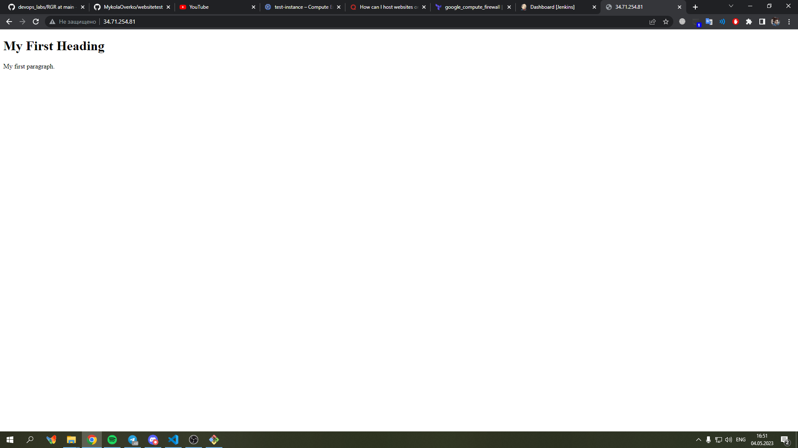

# Мета роботи

Максимально автоматизувати створення віртуальної машини за допомогою Terraform та CI/CD. В межах цієї роботи для прикладу було обрано створення та хостинг вебсайту.

# Хід роботи

Автоматизація створення віртуальної машини за допомогою Terraform вже була виконана у попередній лабораторній роботі 3, тому повторимо кроки з неї. Буде змінено деякі деталі коду, тому його запишемо нижче.

```
terraform {
  required_providers {
    google = {
      source = "hashicorp/google"
      version = "4.51.0"
    }
  }
}

provider "google" {
  credentials = file(var.credentials_file)
  project = var.project
  region  = var.region
  zone    = var.zone
}

resource "google_compute_network" "vpc_network" {
  name = "test-network"
}

resource "google_compute_instance" "vm_instance" {
  name         = "test-instance"
  machine_type = "e2-micro"
  tags = ["khai", "university", "test", "devops", "group-546", "site", "website", "apache"]

  boot_disk {
    initialize_params {
      image = "debian-cloud/debian-11"
    }
  }

  network_interface {
    network = google_compute_network.vpc_network.name
    access_config {
    }
  }
}
resource "google_compute_firewall" "firewall_rules" {
  project       = var.project
  name          = "test-firewall-rule"
  network       = google_compute_network.vpc_network.name
  description   = "Enables all instances in the vpc_network to be able to be connected to from external devices"
  source_ranges = ["0.0.0.0/0"]

  allow {
    protocol = "tcp"
    ports = ["22", "8080"]
  }
  target_tags = ["http-server", "https-server"]
}
```

 Дані у variables.tf:

```
variable "project" {
    default = "websitetest-385705"
 }

variable "credentials_file" {
    default = "FILE_NAME.json"
 }

variable "region" {
  default = "us-central1"
}

variable "zone" {
  default = "us-central1-c"
}

variable "subnet-region" {
  default = "us-central1"
}
```

Серед коду необхідно відмитити створення правило для брандмауера, відкриття портів та відкриття http і https доступу.

Виконуємо команду terraform apply у Windows PowerShell та дивимося на результат. Дійсно, створилося все, що було вказано у попередньому коді. Перейдемо до встановлення необхідних пакетів та налаштування Jenkins. Для цього під'єднаємося до створеної машини по SSH. 

```
sudo apt update
```

Встановлюємо git.

```
sudo apt install git
```

Встановлюємо Java для подальшої роботи з Jenkins.

```
sudo apt install openjdk-17-jre
```

Слідуємо за інструкцією по встановленню Jenkins.

```
curl -fsSL https://pkg.jenkins.io/debian/jenkins.io-2023.key | sudo tee \
  /usr/share/keyrings/jenkins-keyring.asc > /dev/null

echo deb [signed-by=/usr/share/keyrings/jenkins-keyring.asc] \
  https://pkg.jenkins.io/debian binary/ | sudo tee \
  /etc/apt/sources.list.d/jenkins.list > /dev/null

sudo apt-get update

sudo apt-get install jenkins
```

Після перезапуску машини під'єднуємося за external ip-адресою машини та порт 8080 до Jenkins'у. При першому з'єднанні необхідно ввести пароль тому знаходимо його за допомогою команди.

```
sudo cat /var/lib/jenkins/secrets/initialAdminPassword
```

Проводимо швидке налаштування та створюємо новий пайплайн проект. До нього повернемося пізніше

Необхідно створити git репозиторій, з якого Jenkins буде брати код для розгортання. Нашою задачою є створення вебсайту, тому встановимо Apache2 web server.

```
sudo apt-get install apache2
```

Одразу після встановлення можна перейти по external ip-адресі машини та переконатися, що сайт працює. Нам буде показано сторінку, яка використовується за замовчуванням, але вона нам не потрібна.

Створимо репозиторій git з назвою websitetest та загрузимо туди наш index.html. Це виконується на локальному комп'ютері за допомогою команд

```
git clone git@github.com:MykolaOverko/websitetest.git
git add .
git commit -m
git push
```

У проміжку між git clone та git add було створено наш index.html.

Спробуємо завантажити та замінити index.html, який використовує Apache2, за допомогою Jenkins. Для цього створимо такий пайплайн:

```
pipeline {
    agent any
    options {
        disableConcurrentBuilds()
    }
    stages {
        stage('Checkout') {
            steps {
                checkout scmGit(
                    branches: [[name: 'main']],
                    userRemoteConfigs: [[url: 'https://github.com/MykolaOverko/websitetest.git']])
            }
        }
        stage('Build') {
            steps {
                sh 'sudo cp /var/lib/jenkins/workspace/website/* /var/www/html/'
            }
        }
    }
}
```

Також для його виконання нам необхідно надати права Jenkins'у. Для цього переходимо у віртуальну машину та пишемо наступну команду:

```
sudo visudo
```

У відкритому файлі необхідно дописати jenkins, результат повинен виглядати так:

```
# User privilege specification
root    ALL=(ALL:ALL) ALL
jenkins ALL=NOPASSWD: ALL
```

Зберігаємо його, після чого можна запускати пайплайн Jenkins. Build пройшов успішно, можна перейти та подивитися на створену сторінку



На вигляд не дуже, але все працює як потрібно. Тепер необхідно створити вебхук, який буде запускати Build кожного разу при оновленні репозиторію git. Для цього переходимо у конфігурування проекту Jenkins та проставляємо галочку GitHub hook trigger for GITScm polling. Також необхідним є вказання адреси GitHub для створеного репозиторію у Jenkins. 


Тепер перейдемо у налаштування самого репозиторію. Зверху натискаємо на вкладку Settings та переходимо у розділ Webhooks. Створюємо новий вебхук, у Payload URL вказуємо адресу нашого Jenkins та додаємо /github-webhook/ до неї, Content type обираємо application/json. Серед подій, які будуть викликати вебхук обираємо лише push.

Можна сказати, що робота було виконано. Тепер залишилося лише виконати перевірку роботи вебхуку. Для цього було створено новий дизайн сторінки та загружено його у репозиторій за допомогою команди git push. Після цього Jenkins має автоматично оновити наш веб сервер, тому переходимо за адресою та дивимося:


Висновки

При виконанні розрахунково-графічної роботи було опрацьовано автоматизацію створення віртуальних машин, мереж, правил для брандмауера. Розглянуто роботу з Jenkins та створення вебхуків між ним та GitHub. Реалізовано CI/CD для коду сторінки вебсайту. Не можна не зазначити мій талант до веб дизайну.
